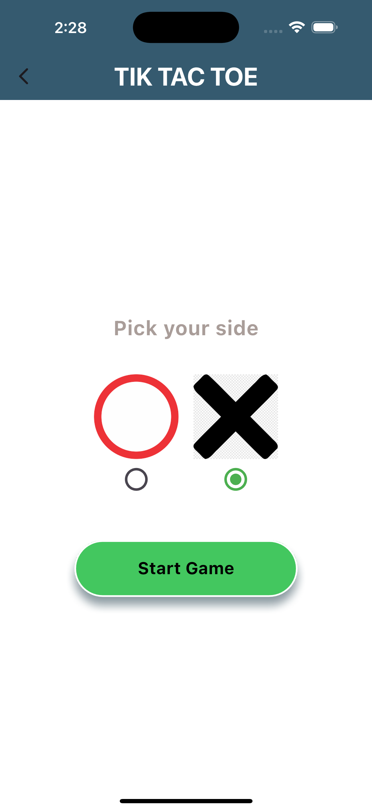
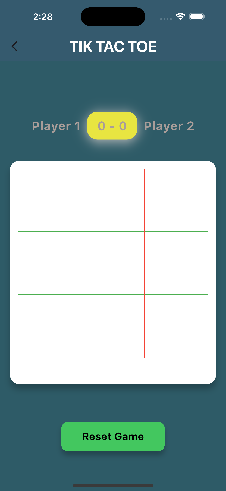

# 🎯 Tic Tac Toe Game

A simple and fun Flutter app to play the classic Tic Tac Toe game. Challenge your friends on the same device with a clean and intuitive interface.

## 📱 Features

- Two-player game (play with a friend on one device)  
- Detects win, lose, and draw conditions  
- Restart the game anytime  
- Simple and responsive UI  
- Works on both Android and iOS

## 🚀 Getting Started

### Requirements

- Flutter SDK  
- Android Studio, VS Code, or any preferred IDE  
- A working Android/iOS emulator or physical device

### Installation

1. Clone this repository  
   `git clone https://github.com/Pragyanadhikari/Tiktactoe-mobile-game.git`

2. Navigate to the project directory  
   `cd Tiktactoe-mobile-game`

3. Get the dependencies  
   `flutter pub get`

4. Run the app  
   `flutter run`

## 📸 Screenshots

  
  &nbsp;&nbsp;&nbsp;&nbsp;&nbsp;
  
  &nbsp;&nbsp;&nbsp;&nbsp;&nbsp;
  
  &nbsp;&nbsp;&nbsp;&nbsp;&nbsp;
  
  &nbsp;&nbsp;&nbsp;&nbsp;&nbsp;
  

## 🛠️ Technologies Used

- Flutter  
- Dart

---

Made with ❤️ using Flutter
